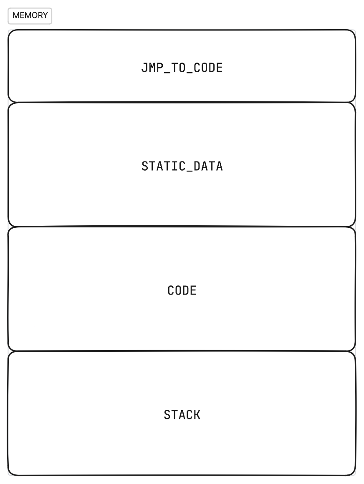
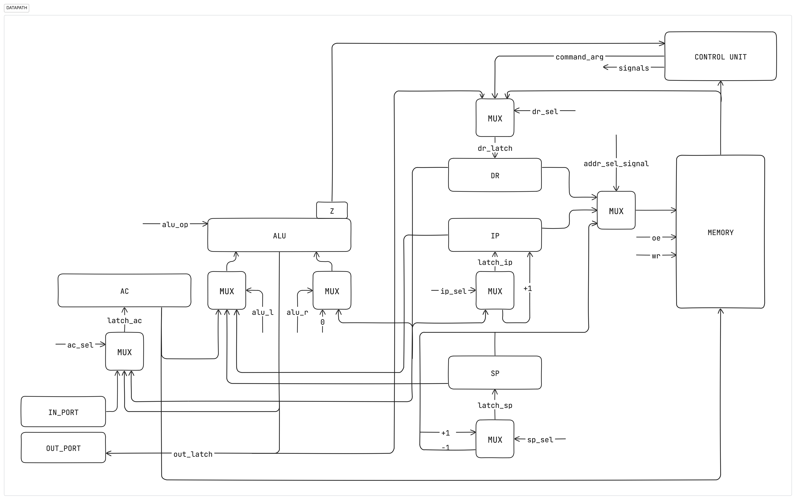
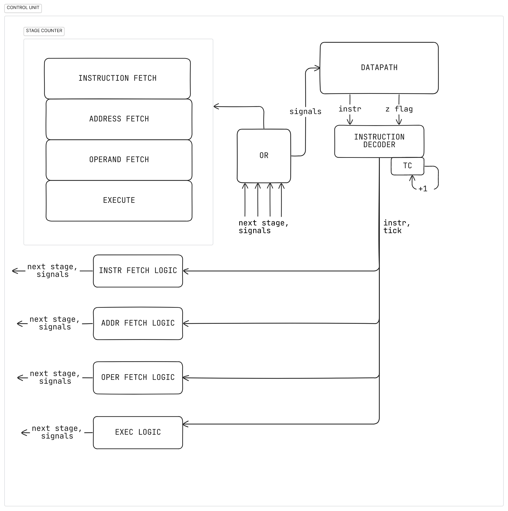

# Отчёт по лабораторной работе № 3

Выполнил Соколов Анатолий Владимирович P3212

Вариант
```lisp | acc | neum | hw | instr | binary | stream | port | pstr | prob2```

Без усложнения

## Язык программирования

Язык lisp-подобный.

Любое выражение в скобках (s-expression) возвращает значение.
Поддерживаются числовые и строковые литералы.
Типизация динамическая, поддерживаются два типа: целые числа и строки. Причем
функции `get_char`, `print_char` работают именно с целыми числами.
Для `while` и `if` можно использовать целые числа, где `0` - это `false`, а любое другое число - `true`.

``` ebnf
program = s_expression

s_expression = "(" atom ")" | expression | "("s_expression")"
   
atomic_symbol = identifier | string_literal | number

expression = defun_expr 
    | if_expr 
    | while_expr 
    | setq_exp
    | print_char_exp
    | print_string_exp
    | user_defined_function_call_exp
    | progn_exp
    | import_expr
    
defun_expr = "(" "defun" identifier "(" identifiers ")" s_expression ")"

import_expr = "(" "import" *path-to-file ")

identifiers = identifier | identifier identifiers

if_expr = "(" "if" s_expression s_expression s_expression ")"

while_expr = "(" "while" s_expression s_expression ")"

setq_exp = "(" "setq" identifier s_expression ")"

print_char_exp = "(" "print_char" s_expression ")"

print_string_exp = "(" "print_string" s_expression ")"

user_defined_function_call_exp = "(" identifier s_expressions ")"

progn_exp = "(" "progn" s_expressions ")"

s_expressions = s_expression | s_expression s_expressions

identifier = idenitfier_symbol | identifier_symbol identifier

idenitfier_symbol = letter | "_"

string_literal = "\"" *any symbol* "\""
```

* `defun` - определение функции, возвращает 0. Рекурсивные функции не поддерживаются, так как не требовались.
* `if` - условный оператор, возвращает значение второго выражения, если первое не равно 0, иначе третье.
Обязательно должно быть три выражения - условие, ветка иначе, ветка истины.
* `while` - цикл с предусловием, возвращает результат последнего выражения в теле цикла в последней итерации.
* `setq` - присваивание, возвращает значение присвоенной переменной.
* `print_char` - выводит символ с кодом, равным значению выражения, возвращает код символа.
* `print_string` - выводит строку, равную значению выражения, возвращает выведенную строку.
* `progn` - последовательное выполнение выражений, возвращает результат последнего выражения.
* вызов функции - возвращает результат функции (последнего выражения в теле функции).
* литералы - возвращают сами себя.
* идентификаторы - возвращают значение переменной, к которой они привязаны.
Использование идентификатора функции без ее вызова недопустимо.

## Организация памяти 

Фон Неймановская архитектура.

Память представляет из себя четыре секции:



* `JMP_TO_CODE` - единственная инструкция, которая по своей сути является адресной командой
JMP, которая переходит на начало секции `CODE`.

* `STATIC_DATA` - секция, в которой хранятся строки (строковые литералы, а также строки, введенные пользователем)
Строки расположены в том порядке, в котором они встречаются в AST программы (в этом контексте объявление буффера для
ввода пользователя - тоже строка)

* `CODE` - секция, в которой хранятся инструкции.

После вычисления любого выражения, его результат кладется в аккумулятор.
При вычислении выражения с бинарным оператором, второй операнд вычисляется, кладется на стек,
после чего вычисляется перывый и проводится операция над ними с помощью адресации относительно стека.

Функции хранятся в секции `CODE` в виде списка инструкций, которые выполняются последовательно. Перед
телом функции идет инструкция `JMP`, которая позоляет перепрыгнуть через ее тело.

Все переменные аллоцируются на стеке. Если при этом переменная была объявлена внутри функции,
область ее видимости ограничивается телом функции.

Числовые литералы загружаются с помощью непосредственной адресации, считается, что они всегда помещаются в
машинное слово.

Так как у процессора аккумуляторная архитектура, то в аккумуляторе всегда хранится лишь результат последнего
вычисленного выражения, дополнительных регистров для хранения исключительно переменных нет.

## Система команд

* Машинное слово - 64 бита, знаковое.
* Так как архитектура аккумуляторная, все команды имеют всего один аргумент (или ни одного), а регистр
общего назначения всего один.
* Ввод-вывод осущетсвляется как поток токенов, port-mapped.
* Поток управления:
  * Поддерживаются условные и безусловные переходы.
  * В случае, если инструкция не касается переходов, то после нее инкрементится IP (Instruction Pointer).

Поддерживаются 4 вида адресации:
* Непосредственная
* Относительно стека
* Косвенная (относительно значения по переданному адресу)
* Адресная

Также команда может быть direct-ной.

На выполнение каждой инструкции есть 4 цикла:
1. Цикл выборки инструкции. (2 такта)
2. Цикл выборки адреса (для адресации относительно стека и косвенной). (1 такт)
3. Цикл выборки операнда (для всех видов адресации, кроме непосредственной). (1 такт)
4. Цикл исполнения.

### Набор инструкций

| Инструкция | addr/direct | Количество тактов в цикле исполнения | Описание                                                             |
|------------|------------|--------------------------------------|----------------------------------------------------------------------|
| `LD`       | addr        | 1                                    | AC <- MEM(ARD)                                                       |
| `ST`       | addr        | 1                                    | MEM(ARD) <- AC                                                       |
| `ADD`      | addr        | 1                                    | AC <- AC + MEM(ARD)                                                  |
| `SUB`      | addr        | 1                                    | AC <- AC - MEM(ARD)                                                  |
| `MUL`      | addr        | 1                                    | AC <- AC * MEM(ARD)                                                  |
| `DIV`      | addr        | 1                                    | AC <- AC / MEM(ARD)                                                  |
| `MOD`      | addr        | 1                                    | AC <- AC % MEM(ARD)                                                  |
| `EQ`       | addr        | 1                                    | if AC == MEM(ARD) then AC <- 1 else AC <- 0                          |
| `GT`       | addr        | 1                                    | if AC > MEM(ARD) then AC <- 1 else AC <- 0                           |
| `LT`       | addr        | 1                                    | if AC < MEM(ARD) then AC <- 1 else AC <- 0                           |
| `JZ`       | addr        | 1                                    | if AC == 0 then IP <- ARD                                            |
| `JNZ`      | addr        | 1                                    | if AC != 0 then IP <- ARD                                            |
| `JMP`      | addr        | 1                                    | IP <- ARD                                                            |
| `PUSH`     | direct     | 2                                    | SP <- SP - 1; MEM(SP) <- AC                                          |
| `POP`      | direct     | 1                                    | SP <- SP + 1                                                         |
| `IN`       | direct     | 1                                    | AC <- next_token                                                     |
| `OUT`      | direct     | 1                                    | print AC                                                             |
| `CALL`     | addr        | 3                                    | SP <- SP - 1; MEM(SP) <- IP; IP <- ARD                               |
| `RET`      | direct     | 2                                    | IP <- MEM(SP); SP <- SP + 1                                          |
| `HLT`      | direct     | 1                                    | завершение работы программы                                          |

## Траслятор
Транслятор состоит из двух частей:
* Лексер, реализован в [tokenizer](./computer_simulator/translator/tokenizer.py)
* Модуль, преобразующий токены в программу, реализован в [expression_translator](./computer_simulator/translator/expression_translator.py)

Также транслятор поддерживает базовый препроцессинг (поддерживается директива `import`, которая инлайнит весь код по указанному файлу на место самого выражения, содержащего директиву). Это позволяет, например, выделить функцию `print_int` в отдельную библиотеку [здесь](./useful_functions/io.lisp)

На вход принимает два файла:
* Файл с программой на языке высокого уровня.
* Путь к файлу, в который будет записана программа в машинных словах (в виде JSON)

## Модель процессора
Модель процессора реализована в [machine](./computer_simulator/machine)

### DataPath



Реализован в классе `DataPath`

Элементы:
* `Z` - Флаг zero
* `DR` - Data Register
* `IP` - Instruction Pointer
* `SP` - Stack Pointer
* `AC` - Accumulator
* `ALU` - Arithmetic Logic Unit

### ControlUnit
Реализован в классе `ControlUnit`



Основная работа с данными происходит на уровне DataPath, а ControlUnit с помощью
сигналов работает с этими данными. ControlUnit реализован как hardwired.

## Тестирование

Для CI использовался пайплайн из примера, но модифицированный под гитхаб:
```yaml
name: Python CI

on:
  push:
    branches:
      - master

jobs:
  computer-simulator:
    runs-on: ubuntu-latest

    steps:
    - name: Checkout code
      uses: actions/checkout@v2

    - name: Set up Python
      uses: actions/setup-python@v3
      with:
        python-version: 3.12

    - name: Install dependencies
      run: |
        python -m pip install --upgrade pip
        pip install poetry
        poetry install

    - name: Run tests and coverage
      run: |
        poetry run pytest --verbose
        poetry run coverage run -m pytest
        poetry run coverage report

    - name: Run mypy checks
      run: poetry run mypy .

    - name: Check code formatting
      run: poetry run ruff format --check .

    - name: Run code linting
      run: |
        poetry run ruff check .
```
В качестве линтеров используются `ruff`, `mypy`. Тесты с помощью `pytest`.

Реализованы unit тесты для лексера ([test_tokenizer](./test/test_tokenizer.py))
Также реализованы golden тесты согласно примеру ([test_golden](./test/test_golden.py)):
* [hello](./golden/hello.yml)
* [cat](./golden/cat.yml)
* [hello_user_name](./golden/hello_user.yml)
* [prob2](./golden/prob2.yml)

Также реализованы некоторые дополнительные алгоритмы:
* [every_statement_is_expression](./golden/every_statement_is_expression.yml)
* [if_demo](./golden/if_demo.yml)
* [many_variables](./golden/many_variables.yml)

### Подробный разбор одной из программ
Возьмем программу (cat):

```lisp
  (progn 
    (read_char a)
    (while (> a 0)
      (progn
        (print_char a)
        (read_char a))))
```

После трансляции она будет выглядеть вот так:
```
00000000  0c 00 00 00 00 00 02 00  0e 00 00 00 00 00 00 00  |................|
00000010  11 00 00 00 00 00 00 00  01 c0 00 00 00 00 00 00  |................|
00000020  00 00 00 00 00 00 00 00  0e 00 00 00 00 00 00 00  |................|
00000030  00 c0 00 00 00 00 00 01  05 c0 00 00 00 00 00 00  |................|
00000040  0d 00 00 00 00 00 00 00  0a 40 00 00 00 00 02 0e  |.........@......|
00000050  00 c0 00 00 00 00 00 00  12 00 00 00 00 00 00 00  |................|
00000060  11 00 00 00 00 00 00 00  01 c0 00 00 00 00 00 00  |................|
00000070  0c 40 00 00 00 00 02 03  13 00 00 00 00 00 00 00  |.@..............|
00000080
```

Если не умеете читать hexdump'ы: при вызове транслятора создается файл `sys.argv[2].debug.txt`
```txt
0000 - 0C0000000000000200 - JMP 512 (ADDRESS)
0200 - 0E0000000000000000 - PUSH 
0201 - 110000000000000000 - IN 
0202 - 010000000000000000 - ST 0 (STACK_OFFSET)
0203 - 000000000000000000 - LD 0 (DIRECT)
0204 - 0E0000000000000000 - PUSH 
0205 - 000000000000000001 - LD 1 (STACK_OFFSET)
0206 - 050000000000000000 - GT 0 (STACK_OFFSET)
0207 - 0D0000000000000000 - POP 
0208 - 0A000000000000020E - JZ 526 (ADDRESS)
0209 - 000000000000000000 - LD 0 (STACK_OFFSET)
020A - 120000000000000000 - OUT 
020B - 110000000000000000 - IN 
020C - 010000000000000000 - ST 0 (STACK_OFFSET)
020D - 0C0000000000000203 - JMP 515 (ADDRESS)
020E - 130000000000000000 - HLT 

```
В начале происходит пропуск статической памяти, иницилизируется перменная `a` посредством пуша ее на стек.
Далее она считывается впервые и начинается цикл.
В начале цикла мы делаем `JNZ` на случай, если из ввода нам пришел `0`, что будет означать, что в буффере не осталось
символов.
Далее с помощью вызовов `OUT` и `IN` мы выводим пришедший нам символ и считываем его снова.
В конце тела цикла мы делаем `JMP` в его начало, чтобы вновь свериться с условием продолжения.

Лог модели процессора (его начало) выглядит вот так:
```log
DEBUG:root:INSTR_N: 0, TICK: 0, IP: 0, DR: 0, AR: 0, AC: 0, Z: True, INSTR: None, SP: 2048, Stack: 
DEBUG:root:INSTR_N: 1, TICK: 3, IP: 512, DR: 512, AR: 0, AC: 0, Z: True, INSTR: Instr(JMP arg[512 (ADDRESS)] ), SP: 2048, Stack: 
DEBUG:root:INSTR_N: 2, TICK: 6, IP: 513, DR: 512, AR: 0, AC: 0, Z: True, INSTR: Instr(PUSH), SP: 2047, Stack: 0 
DEBUG:root:INSTR_N: 2, TICK: 7, IP: 513, DR: 512, AR: 0, AC: 0, Z: True, INSTR: Instr(PUSH), SP: 2047, Stack: 0 
DEBUG:root:IN: 102 - "f"
DEBUG:root:INSTR_N: 3, TICK: 10, IP: 514, DR: 512, AR: 0, AC: 102, Z: True, INSTR: Instr(IN), SP: 2047, Stack: 0 
DEBUG:root:INSTR_N: 4, TICK: 14, IP: 515, DR: 2047, AR: 0, AC: 102, Z: False, INSTR: Instr(ST arg[0 (STACK_OFFSET)] ), SP: 2047, Stack: 102 
DEBUG:root:INSTR_N: 5, TICK: 17, IP: 516, DR: 0, AR: 0, AC: 0, Z: False, INSTR: Instr(LD arg[0 (DIRECT)] ), SP: 2047, Stack: 102 
DEBUG:root:INSTR_N: 6, TICK: 20, IP: 517, DR: 0, AR: 0, AC: 0, Z: False, INSTR: Instr(PUSH), SP: 2046, Stack: 0 102 
DEBUG:root:INSTR_N: 6, TICK: 21, IP: 517, DR: 0, AR: 0, AC: 0, Z: False, INSTR: Instr(PUSH), SP: 2046, Stack: 0 102 
DEBUG:root:INSTR_N: 7, TICK: 26, IP: 518, DR: 102, AR: 0, AC: 102, Z: False, INSTR: Instr(LD arg[1 (STACK_OFFSET)] ), SP: 2046, Stack: 0 102 
DEBUG:root:INSTR_N: 8, TICK: 31, IP: 519, DR: 0, AR: 0, AC: 1, Z: False, INSTR: Instr(GT arg[0 (STACK_OFFSET)] ), SP: 2046, Stack: 0 102 
DEBUG:root:INSTR_N: 9, TICK: 34, IP: 520, DR: 0, AR: 0, AC: 1, Z: False, INSTR: Instr(POP), SP: 2047, Stack: 102 
DEBUG:root:INSTR_N: 10, TICK: 37, IP: 521, DR: 526, AR: 0, AC: 1, Z: False, INSTR: Instr(JZ arg[526 (ADDRESS)] ), SP: 2047, Stack: 102 
DEBUG:root:INSTR_N: 11, TICK: 42, IP: 522, DR: 102, AR: 0, AC: 102, Z: False, INSTR: Instr(LD arg[0 (STACK_OFFSET)] ), SP: 2047, Stack: 102 
DEBUG:root:OUT: 102 - "f"
DEBUG:root:INSTR_N: 12, TICK: 45, IP: 523, DR: 102, AR: 0, AC: 102, Z: False, INSTR: Instr(OUT), SP: 2047, Stack: 102 
DEBUG:root:IN: 111 - "o"
DEBUG:root:INSTR_N: 13, TICK: 48, IP: 524, DR: 102, AR: 0, AC: 111, Z: False, INSTR: Instr(IN), SP: 2047, Stack: 102 
DEBUG:root:INSTR_N: 14, TICK: 52, IP: 525, DR: 2047, AR: 0, AC: 111, Z: False, INSTR: Instr(ST arg[0 (STACK_OFFSET)] ), SP: 2047, Stack: 111 
DEBUG:root:INSTR_N: 15, TICK: 55, IP: 515, DR: 515, AR: 0, AC: 111, Z: False, INSTR: Instr(JMP arg[515 (ADDRESS)] ), SP: 2047, Stack: 111 
DEBUG:root:INSTR_N: 16, TICK: 58, IP: 516, DR: 0, AR: 0, AC: 0, Z: False, INSTR: Instr(LD arg[0 (DIRECT)] ), SP: 2047, Stack: 111 
DEBUG:root:INSTR_N: 17, TICK: 61, IP: 517, DR: 0, AR: 0, AC: 0, Z: False, INSTR: Instr(PUSH), SP: 2046, Stack: 0 111 
DEBUG:root:INSTR_N: 17, TICK: 62, IP: 517, DR: 0, AR: 0, AC: 0, Z: False, INSTR: Instr(PUSH), SP: 2046, Stack: 0 111 
DEBUG:root:INSTR_N: 18, TICK: 67, IP: 518, DR: 111, AR: 0, AC: 111, Z: False, INSTR: Instr(LD arg[1 (STACK_OFFSET)] ), SP: 2046, Stack: 0 111 
DEBUG:root:INSTR_N: 19, TICK: 72, IP: 519, DR: 0, AR: 0, AC: 1, Z: False, INSTR: Instr(GT arg[0 (STACK_OFFSET)] ), SP: 2046, Stack: 0 111 
DEBUG:root:INSTR_N: 20, TICK: 75, IP: 520, DR: 0, AR: 0, AC: 1, Z: False, INSTR: Instr(POP), SP: 2047, Stack: 111 
DEBUG:root:INSTR_N: 21, TICK: 78, IP: 521, DR: 526, AR: 0, AC: 1, Z: False, INSTR: Instr(JZ arg[526 (ADDRESS)] ), SP: 2047, Stack: 111 
DEBUG:root:INSTR_N: 22, TICK: 83, IP: 522, DR: 111, AR: 0, AC: 111, Z: False, INSTR: Instr(LD arg[0 (STACK_OFFSET)] ), SP: 2047, Stack: 111 
DEBUG:root:OUT: 111 - "o"
DEBUG:root:INSTR_N: 23, TICK: 86, IP: 523, DR: 111, AR: 0, AC: 111, Z: False, INSTR: Instr(OUT), SP: 2047, Stack: 111 
DEBUG:root:IN: 111 - "o"
DEBUG:root:INSTR_N: 24, TICK: 89, IP: 524, DR: 111, AR: 0, AC: 111, Z: False, INSTR: Instr(IN), SP: 2047, Stack: 111 
DEBUG:root:INSTR_N: 25, TICK: 93, IP: 525, DR: 2047, AR: 0, AC: 111, Z: False, INSTR: Instr(ST arg[0 (STACK_OFFSET)] ), SP: 2047, Stack: 111 
DEBUG:root:INSTR_N: 26, TICK: 96, IP: 515, DR: 515, AR: 0, AC: 111, Z: False, INSTR: Instr(JMP arg[515 (ADDRESS)] ), SP: 2047, Stack: 111 
DEBUG:root:INSTR_N: 27, TICK: 99, IP: 516, DR: 0, AR: 0, AC: 0, Z: False, INSTR: Instr(LD arg[0 (DIRECT)] ), SP: 2047, Stack: 111 
DEBUG:root:INSTR_N: 28, TICK: 102, IP: 517, DR: 0, AR: 0, AC: 0, Z: False, INSTR: Instr(PUSH), SP: 2046, Stack: 0 111 
DEBUG:root:INSTR_N: 28, TICK: 103, IP: 517, DR: 0, AR: 0, AC: 0, Z: False, INSTR: Instr(PUSH), SP: 2046, Stack: 0 111 
DEBUG:root:INSTR_N: 29, TICK: 108, IP: 518, DR: 111, AR: 0, AC: 111, Z: False, INSTR: Instr(LD arg[1 (STACK_OFFSET)] ), SP: 2046, Stack: 0 111 
DEBUG:root:INSTR_N: 30, TICK: 113, IP: 519, DR: 0, AR: 0, AC: 1, Z: False, INSTR: Instr(GT arg[0 (STACK_OFFSET)] ), SP: 2046, Stack: 0 111 
DEBUG:root:INSTR_N: 31, TICK: 116, IP: 520, DR: 0, AR: 0, AC: 1, Z: False, INSTR: Instr(POP), SP: 2047, Stack: 111 
DEBUG:root:INSTR_N: 32, TICK: 119, IP: 521, DR: 526, AR: 0, AC: 1, Z: False, INSTR: Instr(JZ arg[526 (ADDRESS)] ), SP: 2047, Stack: 111 
DEBUG:root:INSTR_N: 33, TICK: 124, IP: 522, DR: 111, AR: 0, AC: 111, Z: False, INSTR: Instr(LD arg[0 (STACK_OFFSET)] ), SP: 2047, Stack: 111 
DEBUG:root:OUT: 111 - "o"
DEBUG:root:INSTR_N: 34, TICK: 127, IP: 523, DR: 111, AR: 0, AC: 111, Z: False, INSTR: Instr(OUT), SP: 2047, Stack: 111 
DEBUG:root:IN: 0
DEBUG:root:INSTR_N: 35, TICK: 130, IP: 524, DR: 111, AR: 0, AC: 0, Z: False, INSTR: Instr(IN), SP: 2047, Stack: 111 
DEBUG:root:INSTR_N: 36, TICK: 134, IP: 525, DR: 2047, AR: 0, AC: 0, Z: False, INSTR: Instr(ST arg[0 (STACK_OFFSET)] ), SP: 2047, Stack: 0 
DEBUG:root:INSTR_N: 37, TICK: 137, IP: 515, DR: 515, AR: 0, AC: 0, Z: False, INSTR: Instr(JMP arg[515 (ADDRESS)] ), SP: 2047, Stack: 0 
DEBUG:root:INSTR_N: 38, TICK: 140, IP: 516, DR: 0, AR: 0, AC: 0, Z: False, INSTR: Instr(LD arg[0 (DIRECT)] ), SP: 2047, Stack: 0 
DEBUG:root:INSTR_N: 39, TICK: 143, IP: 517, DR: 0, AR: 0, AC: 0, Z: False, INSTR: Instr(PUSH), SP: 2046, Stack: 0 0 
DEBUG:root:INSTR_N: 39, TICK: 144, IP: 517, DR: 0, AR: 0, AC: 0, Z: False, INSTR: Instr(PUSH), SP: 2046, Stack: 0 0 
DEBUG:root:INSTR_N: 40, TICK: 149, IP: 518, DR: 0, AR: 0, AC: 0, Z: False, INSTR: Instr(LD arg[1 (STACK_OFFSET)] ), SP: 2046, Stack: 0 0 
DEBUG:root:INSTR_N: 41, TICK: 154, IP: 519, DR: 0, AR: 0, AC: 0, Z: True, INSTR: Instr(GT arg[0 (STACK_OFFSET)] ), SP: 2046, Stack: 0 0 
DEBUG:root:INSTR_N: 42, TICK: 157, IP: 520, DR: 0, AR: 0, AC: 0, Z: True, INSTR: Instr(POP), SP: 2047, Stack: 0 
DEBUG:root:INSTR_N: 43, TICK: 160, IP: 526, DR: 526, AR: 0, AC: 0, Z: True, INSTR: Instr(JZ arg[526 (ADDRESS)] ), SP: 2047, Stack: 0 
DEBUG:root:INSTR_N: 44, TICK: 163, IP: 527, DR: 526, AR: 0, AC: 0, Z: True, INSTR: Instr(HLT), SP: 2047, Stack: 0 
```

Здесь показаны значения регистров, флага zero, раскодированной инструкции и стека (сверху вниз) в конце каждого из тактов.

## Аналитика

| ФИО                     | алг.   | LoC       | code байт | code инстр. | инстр. | такт. | вариант |
|--------------------------|-------|-----------|-----------|-------------|--------|-------|---------|
| Соколов Анатолий Владимирович | hello | 3         | 328             | 41            | 96       | 368     | lisp \| acc \| neum \| hw \| instr \| binary \| stream \| port \| pstr \| prob2 \| - \|   |
| Соколов Анатолий Владимирович | cat   | 6         | 128             | 16            | 44       | 163     | lisp \| acc \| neum \| hw \| instr \| binary \| stream \| port \| pstr \| prob2 \| - \|   |
| Соколов Анатолий Владимирович | prob2   | 19        | 1.3k             | 157            | 1269       | 5058     | lisp \| acc \| neum \| hw \| instr \| binary \| stream \| port \| pstr \| prob2 \| - \|   |
